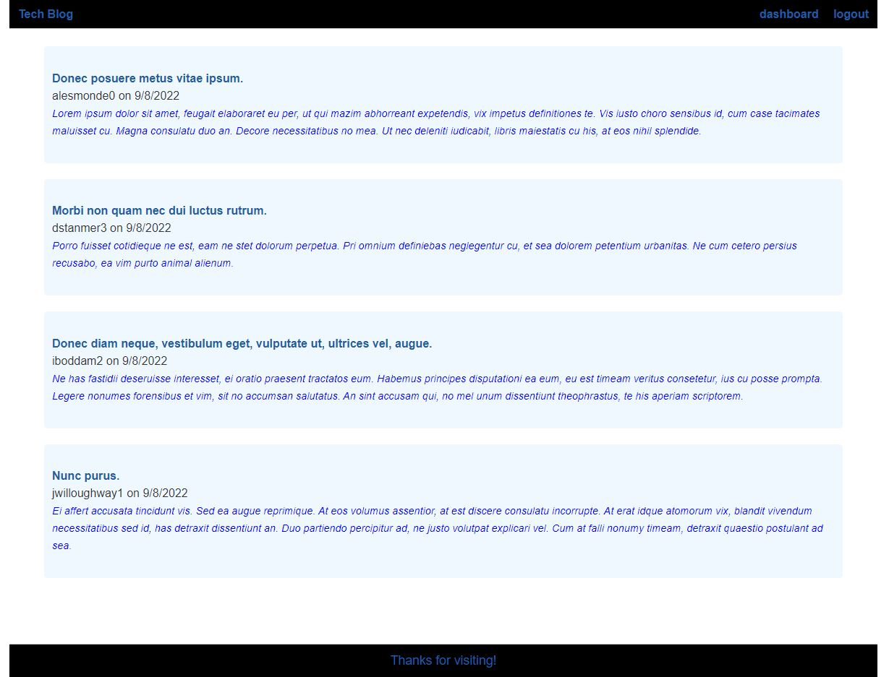

# tech-blog
## Blog with login utilization to view, comment, create, edit, and delete posts
 

### Once opening the webpage, you will be taken to a home page showing all posts with their author and creation date. From the homepage you can click Dashboard (will redirect to login if not signed in), login (to sign in), or on one of the posts.
#### clicking on the title (Tech Blog) will redirect you to the homepage

### On dashboard you can view your posts and associated comments, posts can be edited from here. If edit is selected, you can update or delete your post.
### You can comment on other posts.
 

### This project utilizes mysql, dotenv, sequelize, express, express-handlebars, express-sessions, and connect-session-sequelize.
#### The schema will need to be sourced in mysql prior to running npm start. The seeds will also need to be activated by npm run seed.

# Screenshot Below:

 
 

# URL Links:
 
## Tech Blog on Heroku: https://agile-dusk-84172.herokuapp.com/ 
